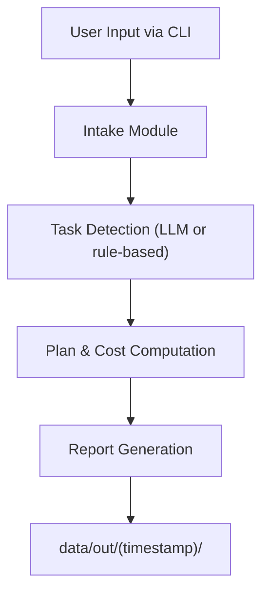

# 🧩 AI Cost Estimator — System Architecture

## 🏗️ Overview

The **AI Cost Estimator** is a modular, Dockerized CLI application that collects user inputs, detects tasks using LLMs, and computes cost estimates for GenAI application development.

---

## 🗂️ Project Folder Structure

```
.
├── data
│   ├── raw
│   │   └── AI_Cost_Estimator_Catalog_UPDATED.xlsx
│   └── out                     # Generated outputs (auto-created after runs)
├── docs
│   └── ARCHITECTURE.md
├── src
│   └── app
│       ├── cli
│       │   ├── __init__.py
│       │   ├── commands.py
│       │   └── pipeline.py
│       ├── core
│       │   ├── __init__.py
│       │   ├── cli_intake.py
│       │   ├── formulas.py
│       │   ├── plan_and_cost.py
│       │   ├── pricing_dict.py
│       │   └── task_detect.py
│       ├── llm
│       │   ├── providers
│       │   │   ├── google.py
│       │   │   ├── grok.py
│       │   │   ├── openai.py
│       │   │   └── perplexity.py
│       │   ├── __init__.py
│       │   ├── config.py
│       │   └── selector.py
│       ├── utils
│       │   ├── __init__.py
│       │   └── io_paths.py
│       └── __init__.py
├── utils
│   ├── example_prompts.json
│   ├── generate_root_folder_tree.py
│   └── clean_folder_structure.txt
├── docker-compose.yml
├── Dockerfile
├── requirements
├── LICENSE
├── .env.example
├── .gitignore
└── README.md
```

---

## ⚙️ Component Architecture

### 1. CLI Layer (`src/app/cli/`)
- **pipeline.py** — orchestrates the entire process (`intake → detect → plan_and_cost`).
- **commands.py** — defines CLI behavior and command-line entrypoints.

### 2. Core Logic (`src/app/core/`)
- **cli_intake.py** — handles interactive intake of app details and requirements.
- **task_detect.py** — uses LLMs to map user inputs to predefined catalog tasks.
- **plan_and_cost.py** — performs plan generation, cost computation, and output formatting.
- **formulas.py** — contains mathematical and cost-related formulas.
- **pricing_dict.py** — stores pricing references for models and APIs.

### 3. LLM Layer (`src/app/llm/`)
- **providers/** — abstraction for each supported LLM (OpenAI, Perplexity, Google, Grok).
- **selector.py** — picks the active provider dynamically at runtime.
- **config.py** — manages LLM configuration defaults (e.g., temperature, max_tokens).

### 4. Utilities
- **src/app/utils/io_paths.py** — central reference for I/O directories.
- **utils/example_prompts.json** — example prompts to test task detection.
- **utils/generate_root_folder_tree.py** — script to regenerate project tree documentation.

---

## 🧾 Data Flow



**Explanation:**
1. **CLI Intake** — collects project details interactively.  
2. **Task Detection** — LLM identifies relevant tasks from catalog.  
3. **Plan & Cost** — computes min–max cost estimates and generates reports.  
4. **Outputs** — all results are saved to timestamped folders under `data/out/`.

---

## 📊 Data Artifacts in `data/out/`

| File | Description |
|------|--------------|
| `intake_*.json` | User input metadata |
| `selected_tasks_*.json` | Tasks detected by the LLM |
| `explain_*.md` | Explanation for detected tasks |
| `cost_breakdown_*.json` | Per-task cost structure |
| `cost_summary_*.md` | Human-readable report |
| `run_meta.json` | Run metadata (timestamp, provider, etc.) |

---

## 🧱 Containerization

| File | Description |
|------|--------------|
| **Dockerfile** | Defines Python 3.12-slim image and installs dependencies. |
| **docker-compose.yml** | Mounts `data/` to persist outputs and loads `.env` API keys. |

Command to run:
```bash
docker compose run --rm app
```

---

## 🧩 Future Extensions
- Integration of automatic LLM-based report generation.
- Support for more pricing APIs.
- Web UI using FastAPI + Streamlit or React frontend.

---

## 🧠 Developer Note
The entire pipeline is CLI-first by design — all output paths, logs, and configurations are relative to the `data/` folder.  
To regenerate this document, run:
```bash
python utils/generate_root_folder_tree.py
```
---

# 🪪 License
See [LICENSE](../LICENSE) for license details.
